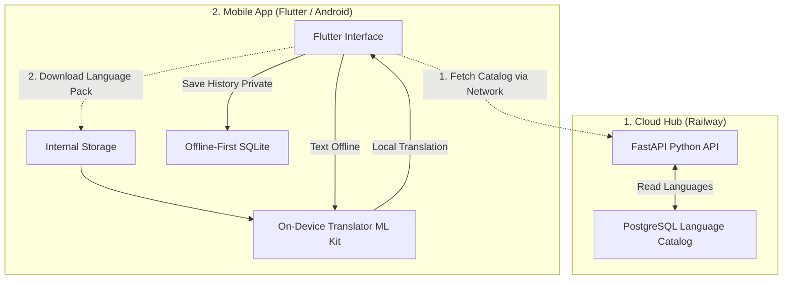

# 🌍 Offline-Translator: Embedded AI (Offline-First)

A universal translator designed for extreme environments (no network, airplane mode). This project demonstrates my ability to design an **"Edge AI"** architecture by running complex machine learning models (NLP) directly on mobile processors in a highly optimized way.

This project is a 100% custom-built "Google Translate Offline" alternative with a strict focus on user privacy.

---

## 🚀 Key Features
- **Ultra-Fast Local Inference (<30ms)**: Leveraging optimized on-device translation models (Google ML Kit).
- **100% Privacy-First**: Guaranteed translation without Wi-Fi or Cellular data. The translation history is securely stored on the device via **SQLite** and is **never** uploaded to the cloud.
- **Dynamic Language Catalog**: The mobile app fetches the latest available languages from a **FastAPI / PostgreSQL** backend (hosted on Railway). You can add new languages to the server, and they will instantly appear in the app.
- **Optimized Resource Consumption**: Designed to preserve RAM and battery life, with lightweight language models (around 30 MB per language pack).
- **Explicit User Consent**: Language models are never downloaded silently. Users must explicitly grant permission before any data-intensive background download.

---

## 🏗️ Project Architecture

The architecture is divided into two main components:
1. **Cloud Hub (Railway)**: A secure backend providing a dynamic catalog of supported languages.
2. **Mobile App (Flutter)**: User interface, local execution using on-device ML Kit models, and private local storage.

---

## 🛠️ Technology Stack
- **AI & NLP**: Google ML Kit Translation (On-Device Inference)
- **Cloud Backend**: Python 3.10, FastAPI, SQLAlchemy, PostgreSQL, Swagger UI (Deployed on Railway)
- **Mobile Application**: Flutter / Dart, `sqflite` (Local database), `google_mlkit_translation`
