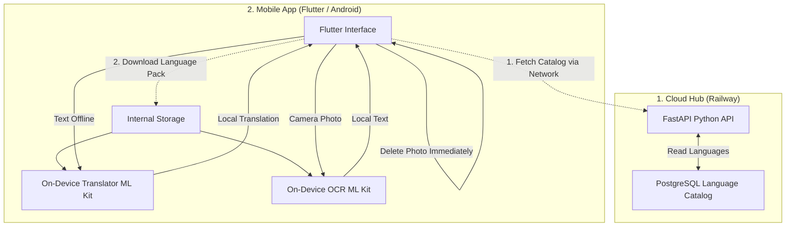

# 🌍 Offline-Translator: Embedded AI (Offline-First)

A universal translator designed for extreme environments (no network, airplane mode). This project demonstrates my ability to design an **"Edge AI"** architecture by running complex machine learning models (NLP) directly on mobile processors in a highly optimized way.

This project is a 100% custom-built "Google Translate Offline" alternative with a strict focus on user privacy.

---

## 🚀 Key Features
- **Ultra-Fast Local Inference (<30ms)**: Leveraging optimized on-device translation and OCR models (Google ML Kit).
- **Camera & Text Recognition (OCR)**: Translate text from photos instantly. Includes a "Recto-Verso" feature to scan both sides of a document. All image processing is done locally, and photos are deleted immediately from memory.
- **100% Privacy-First (Zero Data Retention)**: Guaranteed translation without Wi-Fi or Cellular data. To ensure absolute privacy, there is **no history stored anywhere**—not even locally. No SQLite, no cloud, no traces.
- **Dynamic Language Catalog**: The mobile app fetches the latest available languages from a **FastAPI / PostgreSQL** backend (hosted on Railway). You can add new languages to the server, and they will instantly appear in the app.
- **Optimized Resource Consumption**: Designed to preserve RAM and battery life, with lightweight language models.

---

## 🏗️ Project Architecture

The architecture is divided into two main components:
1. **Cloud Hub (Railway)**: A secure backend providing a dynamic catalog of supported languages.
2. **Mobile App (Flutter)**: User interface, local execution using on-device ML Kit models (Translation + OCR), with zero data retention.



---

## 🛠️ Technology Stack
- **AI & NLP**: Google ML Kit Translation & Text Recognition (On-Device Inference)
- **Cloud Backend**: Python 3.10, FastAPI, SQLAlchemy, PostgreSQL, Swagger UI (Deployed on Railway)
- **Mobile Application**: Flutter / Dart, `google_mlkit_translation`, `google_mlkit_text_recognition`, `image_picker`

---

## 📱 Mobile App: Lancer et Créer l'APK

### Prérequis
- [Flutter SDK](https://docs.flutter.dev/get-started/install) (version `>= 3.1.0`)
- [Android SDK](https://developer.android.com/studio) (Android Studio / Platform Tools)

### 1. Installer les dépendances
```bash
cd mobile
flutter pub get
```

### 2. Lancer l'application en mode développement
Connectez un smartphone Android en USB (avec le débogage USB activé) ou démarrez un émulateur, puis :
```bash
cd mobile
flutter run
```

### 3. Créer l'APK Optimisé par Architecture (Recommandé : ~35 à 47 Mo)
Par défaut, `flutter build apk` crée un APK universel lourd (~125 Mo) regroupant toutes les architectures de processeurs. Pour obtenir des APK légers optimisés par architecture :
```bash
cd mobile
flutter build apk --split-per-abi
```
Les APKs générés seront disponibles dans `mobile/build/app/outputs/flutter-apk/` :
- `app-arm64-v8a-release.apk` (**~47 Mo**) : Pour 99% des smartphones Android modernes (64-bit).
- `app-armeabi-v7a-release.apk` (**~35 Mo**) : Pour les téléphones 32-bit plus anciens.
- `app-x86_64-release.apk` (**~50 Mo**) : Pour les émulateurs.

### 4. Installer l'APK sur un appareil connecté
```bash
# Pour un smartphone récent (64-bit) :
adb install -r mobile/build/app/outputs/flutter-apk/app-arm64-v8a-release.apk
```

### 5. (Optionnel) Créer un Android App Bundle (Google Play Store)
Pour une publication sur le Google Play Store où Google distribue automatiquement le découpage optimal (~25-30 Mo par utilisateur) :
```bash
cd mobile
flutter build appbundle --release
```

---

## ☁️ Backend: Lancer le Cloud Hub (FastAPI)

### En local avec Uvicorn
```bash
cd backend
pip install -r requirements.txt
uvicorn backend.main:app --reload --port 8080
```
Swagger UI accessible sur : `http://localhost:8080/docs`

### Avec Docker
```bash
docker build -t offline-translator-backend -f backend/Dockerfile .
docker run -p 8080:8080 offline-translator-backend
```

